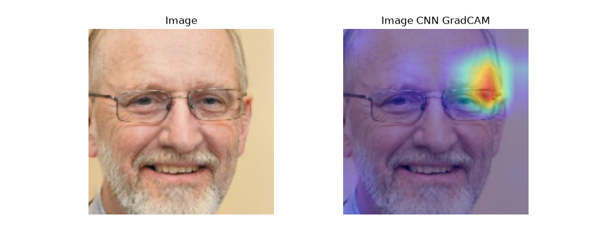
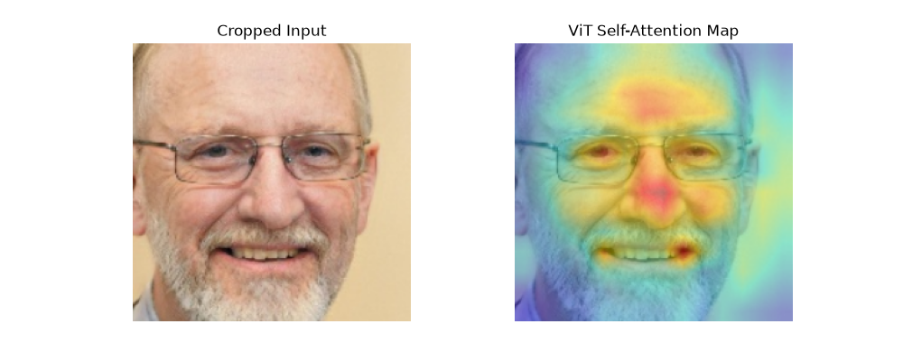
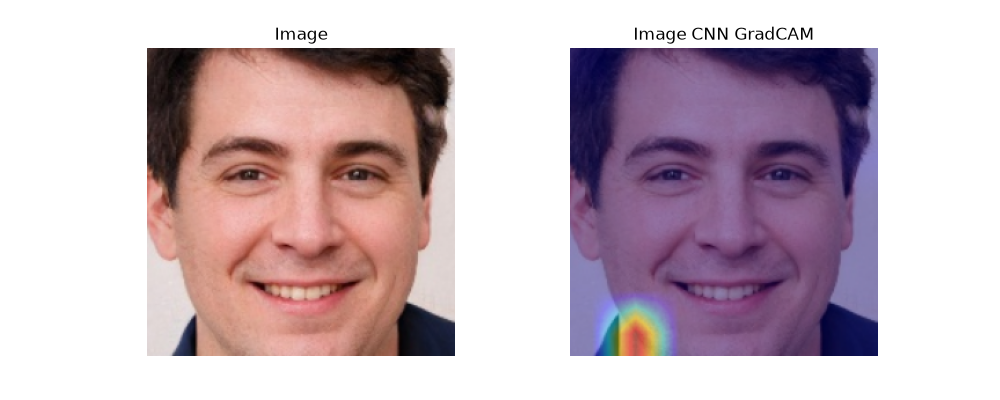
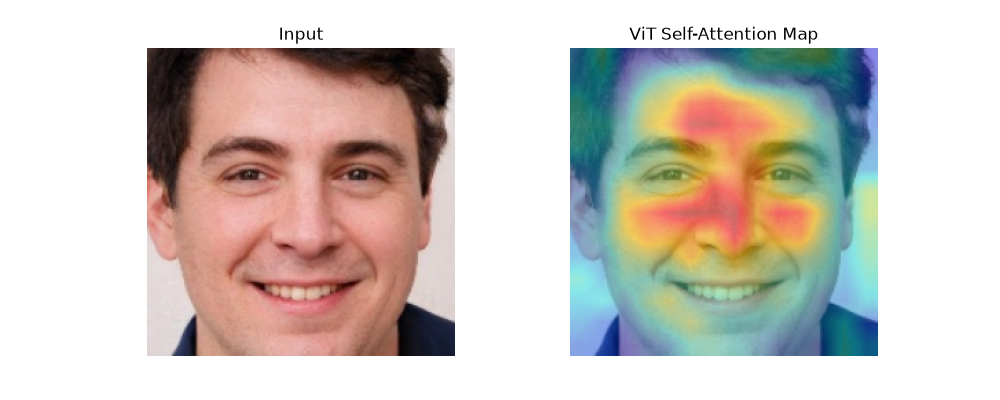

# Deepfake Detection Framework: Comparing CNN and ViT Architectures 
A computer vision pipeline designed to evaluate the workings of Convolutional Neural Networks (CNNs) and Vision Transformers (ViTs) in the task of deepfake detection using the RvF10k dataset. 
Apart from standard metrics to quantify classification accuracy, this project leverages explainable AI (XAI) tools such as Grad-CAM (Gradient ) for CNNs and Attention Rollouts for ViTs to visualize what each model is learning and expose their architectural vulnerabilities. 

## Hypotheses
The project aimed to investigate the following claims:
- CNNs rely on localized filters to scan images for spatial hierarchies, edges, and textures and excel at detecting localized, low-level deepfake artifacts (such as blending boundaries or pixel anomalies).
- ViTs, excellent at understanding global context, spatial relationships, and long-range dependencies, detect holistic inconsistencies (mismatched lighting, unnatural geometry or subtle behavioral patterns across a full face).

## Key Findings
- The shortcut taken by CNNs: The Grad-CAM revealed that the CNN model entirely ignored the face in the image and focused on edges, corners and boundaries, taking advantage of microscopic pixel anomalies and texture blurs to improve accuracy metrics. 
- The ViT, on the other hand, had a broad region of focus across the face, specifically covering the T-zone (forehead, nose bridge and cheeks). 

## Pipeline Architecure and Implementation 
### Models Used:
(From the torchvision models library)
- CNN: Pre-trained ResNet50
- ViT: Pre-trained ViT_B_16 
#### More about the model choice:
The transformer being used was pre-trained on ImageNet-21k. This dataset has around 14M samples. According to the paper that introduced vision tranformers "AN IMAGE IS WORTH 16X16 WORDS: TRANSFORMERS FOR IMAGE RECOGNITION AT SCALE", a vision transformer must be fed massive amounts of data to show performance comparable to CNNs, as it has to learn basic geometry of images from scratch. To ensure a fair comparison of the two architectures, we choose this pre-trained model which was proven to have accuracy in the proximity of ResNets. 
### The Need For Data Augmentation:
Initially, the training dataset images were cropped to focus on the face with a 10% padding. This resulted in the ViT finding a shortcut to improve its training accuracy, as revealed by the attention rollout which highlighted image the boundaries. 
The reason behind this was found to be that deepfake generators like StyleGAN leave microscopic mathematical artifacts near the outer boundary of its generation box. To force the ViT to look at complex facial indicators instead, we dynamically moved around the coordinates of focus. RandomResizedCrop zooms in on different sub-boxes of the face on each training iteration. Now that the edge artifacts can no longer be used to make the classification, the model is forces to look at features that do not change with random zooming, i.e., the face. 

## XAI Findings
Sample 1

Sample 2

